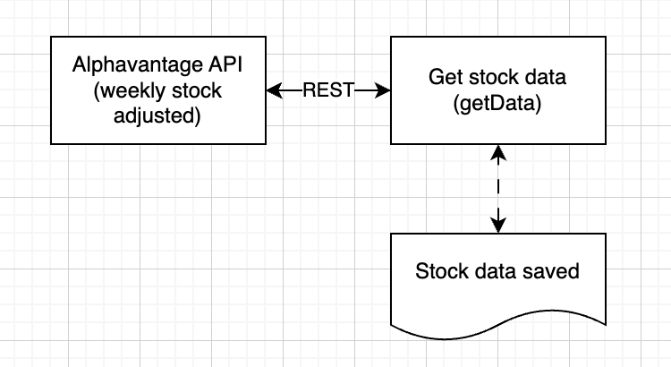

# Machine Learning Project

This project is designed to take a data source (stock price) and process the data through multiple machine learning models. The goal is to predict future stock prices based on historical data using various machine learning techniques.  This is a project intended as a learning experience.  The tutorial I have uses comes from Tensorflow webpage: https://www.tensorflow.org/tutorials/structured_data/time_series

## Overview

The project involves fetching stock price data from an external API, preprocessing the data, and then applying different machine learning models to make predictions. The models include baseline models, linear models, dense neural networks, and convolutional neural networks. The performance of each model is evaluated and compared to determine the most effective approach for stock price prediction.

## Features

- Fetch stock price data from Alphavantage API
- Preprocess and split the data into training, validation, and test sets
- Implement and evaluate various machine learning models
- Visualize the performance of the models
- Provide a command-line interface to specify API key and stock ticker

## Structure
- Jupyter notebook: contains the code to visualise the data, it imports relevant modules and uses and example data set to visualise.
- Main: contains the main code to run the project, it imports relevant modules and uses the data from the API to run the models.



## Technologies Used

- Python
- TensorFlow
- NumPy
- Matplotlib
- argparse
- Logging

## Getting Started

### Dependencies

- Python 3.8 or higher
- TensorFlow 2.0 or higher
- NumPy
- Matplotlib
- argparse

### Installing

1. Clone the repository:
   ```sh
   git clone https://github.com/yourusername/your-repo.git